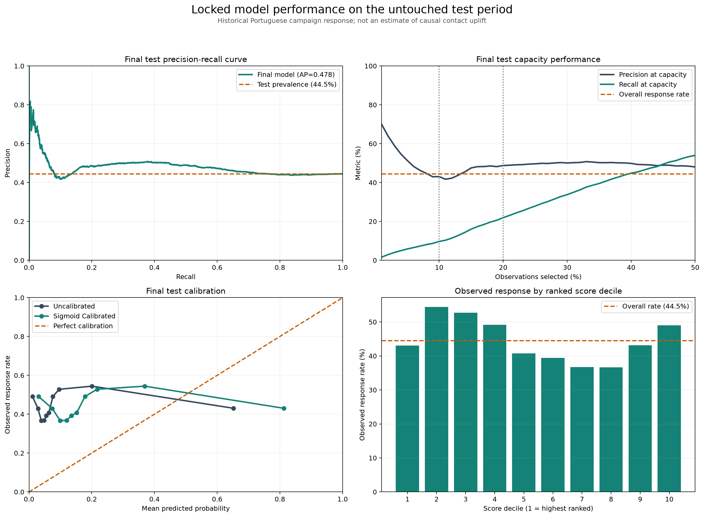

# Before the Call

### Predicting campaign response before outreach

An end-to-end data science project that asks whether historical bank-marketing observations can be ranked before a call when contact capacity is limited.

The project emphasizes decision-time feature availability, leakage prevention, chronological validation, probability calibration, capacity-based evaluation, SQL verification, automated testing, and responsible model reporting.

> **Final conclusion:** the model showed useful validation-period ranking but weak performance in the later untouched test period. It is presented as a model-risk and decision-analysis case study—not a deployment-ready targeting system.

## Project overview

A marketing team may have more eligible observations than it can contact. Instead of applying an arbitrary probability threshold, this project ranks historical observations and evaluates what happens when only the top 10% or 20% can be selected.

The project does **not** claim that contacting someone causes subscription. It predicts historical campaign response, not causal uplift.

## Business question

> Before a scheduled marketing call, can information available at decision time rank historical observations by subscription response when outreach capacity is limited?

### Decision design

| Component | Definition |
|---|---|
| Unit of analysis | One historical campaign/contact observation |
| Target | Whether the observation ended in term-deposit subscription |
| Decision time | Immediately before a scheduled call |
| Output | Ranked observation queue |
| Operational constraint | Select only the number allowed by contact capacity |
| Primary evaluation | Precision, recall, and lift at 10% and 20% capacity |
| Claim boundary | Predictive association, not causal contact effect |

## Dataset

Source: [UCI Bank Marketing dataset](https://archive.ics.uci.edu/dataset/222/bank+marketing)

Selected variant: `bank-additional-full.csv`

- 41,188 observations
- 20 input columns and one target
- Portuguese direct-marketing campaigns
- May 2008 through November 2010
- 4,640 subscriptions
- Overall response rate: 11.27%
- No conventional null cells
- 12 exact duplicate rows retained because no customer identifier exists

The source data is downloaded and checksum-validated by the project rather than committed to Git.

## Leakage prevention

The proposed decision time determines which fields are allowed.

### Excluded

- `duration`: only known after the call and therefore direct leakage
- `campaign`: ambiguous at the exact pre-call scoring moment
- `y`: post-campaign target

### Final model inputs

The selected model uses 13 source features:

- Client attributes: `age`, `job`, `marital`, `education`, `default`, `housing`, `loan`
- Scheduling context: `contact`, `month`, `day_of_week`
- Previous campaign history: `pdays`, `previous`, `poutcome`

Economic indicators were tested but removed from the selected model because they moved outside their training ranges and produced unstable temporal extrapolation.

See [`docs/feature_leakage_audit.csv`](docs/feature_leakage_audit.csv) for the full feature-by-feature decision record.

## Chronological evaluation

The dataset is documented as chronologically ordered. Exact dates are unavailable, so month-level periods are inferred from source ordering and documented coverage.

| Partition | Approximate period | Observations | Response rate | Purpose |
|---|---|---:|---:|---|
| Training | 2008-05 to 2008-11 | 27,680 | 4.83% | Fit preprocessing and base models |
| Validation | 2008-12 to 2009-05 | 8,544 | 12.79% | Select features, model, and calibration |
| Test | 2009-06 to 2010-11 | 4,964 | 44.50% | One-time final evaluation |

The large prevalence change is a central project finding. A random split would mix these historical regimes and create a less realistic evaluation.

## Models compared

- Training-prevalence dummy baseline
- Unweighted logistic regression
- Class-balanced logistic regression
- Unweighted random forest
- Class-balanced random forest

Four feature policies were also tested:

- Full scheduled pre-call features
- No economic indicators
- No scheduling fields
- Core client and previous-campaign fields only

Preprocessing was fitted only on training data. Categorical features use:

```python
OneHotEncoder(handle_unknown="ignore")
```

## Selected model

The locked final model is:

- Regularized unweighted logistic regression
- No-economic feature policy
- Sigmoid probability calibration
- Base model fitted on training data
- Calibrator fitted on validation data
- Model choice committed before opening the test set
- No fixed 0.5 operational threshold

The model ranks observations, and the available contact capacity determines queue size.

## Results

### Validation-period ranking

| Metric | Full scheduled | No economic |
|---|---:|---:|
| Average precision | 0.2386 | 0.2244 |
| Precision at 10% | 29.36% | 26.67% |
| Recall at 10% | 22.96% | 20.86% |
| Lift at 10% | 2.29 | 2.08 |
| Precision at 20% | 24.28% | 24.69% |
| Recall at 20% | 37.97% | 38.61% |
| Lift at 20% | 1.90 | 1.93 |

The full model ranked better at 10% capacity, but its probability estimates collapsed under economic-feature extrapolation. The no-economic model was selected for stronger temporal stability and calibration behavior.

### Untouched test period

| Metric | Result |
|---|---:|
| Test response rate | 44.50% |
| Mean calibrated prediction | 21.88% |
| Calibration gap | −22.62 percentage points |
| Average precision | 0.4782 |
| No-skill AP reference | 0.4450 |
| Brier score | 0.3438 |
| Log loss | 1.0261 |

### Capacity results

| Capacity | Selected | Historical subscribers | Precision | Recall | Lift |
|---|---:|---:|---:|---:|---:|
| 10% | 497 | 214 | 43.06% | 9.69% | 0.97 |
| 20% | 993 | 484 | 48.74% | 21.91% | 1.10 |

At 10% capacity, the locked model performed slightly worse than random ranking. At 20%, it performed only modestly better. These results do not support deployment.



## Why performance weakened

The main causes were:

1. Response prevalence increased from 4.83% in training to 44.50% in testing.
2. Campaign month, channel, previous-campaign history, and economic context changed over time.
3. Some later campaign months were unseen or rare during training.
4. The model overlearned campaign-period effects, including an unstable October coefficient.
5. Exact timestamps and verified customer identifiers were unavailable.
6. Calibration changed the score scale but could not repair ranking relationships that had shifted.

The most important result is that chronological testing exposed a failure that a random split could easily hide.

## Streamlit demonstration

The app is a retrospective historical capacity simulator. It allows a user to:

- vary contact capacity from 1% to 50%;
- inspect the selected ranked queue;
- compare historical precision and recall with random selection;
- switch between decision-time and evaluation views;
- examine score-decile and calibration diagnostics;
- download the selected historical queue;
- review model limitations and claim boundaries.

Run locally:

```bash
streamlit run app/streamlit_app.py
```

The deployed app uses a tracked, anonymized, pre-scored historical demonstration file. It does not contain current customers or current US-market predictions.

## SQL analytics layer

The project builds a local SQLite database containing all chronological partitions and locked test-period scores.

The SQL layer demonstrates:

- common table expressions;
- reusable analytical views;
- `ROW_NUMBER()` ranking;
- `NTILE()` score deciles;
- conditional aggregation;
- capacity-based selection;
- group calibration audits;
- validation of SQL results against Python outputs.

Build the database and exports:

```bash
python src/18_build_sql_analytics.py
```

The generated SQLite database remains local and is ignored by Git.

## Automated tests

The test suite protects the core analytical contracts:

- leakage fields remain excluded;
- the selected 13-feature policy remains unchanged;
- the model-selection manifest records pre-test locking;
- demo data matches the locked test partition;
- 10% and 20% capacity counts remain reproducible;
- exported metrics match calculations from scored observations;
- Python and SQL results agree.

Run:

```bash
pytest -q
```

Current result:

```text
8 passed
```

## Limitations

- Historical Portuguese campaign data from 2008–2010 may not represent current behavior.
- Exact contact timestamps are unavailable.
- Customer identifiers are unavailable, so repeated customers cannot be grouped.
- Inferred month-level chronology is less precise than exact timestamp-based validation.
- `unknown` categories represent semantic missingness whose collection process is undocumented.
- Scheduling variables assume channel and call date are known before scoring.
- The test period exhibits substantial prevalence and feature shift.
- Probability calibration remains poor in the untouched test period.
- Demographic associations are not causal explanations or fairness certification.
- Historical response prediction does not estimate campaign uplift.

## Deployment recommendation

Do **not** deploy the current model.

A future production candidate would require:

- recent and representative training data;
- verified customer and contact identifiers;
- exact timestamps;
- rolling or walk-forward validation;
- monitored feature, prevalence, ranking, and calibration drift;
- documented recalibration and retraining rules;
- subgroup monitoring and governance;
- a randomized experiment or credible uplift design for causal targeting claims.

## Technology

- Python
- pandas and NumPy
- scikit-learn
- SQLite and SQL
- Matplotlib and Plotly
- Streamlit
- PyArrow and Parquet
- pytest
- Git and GitHub

## Responsible interpretation

This project estimates patterns in historical campaign response. It does not prove that outreach caused subscription, does not claim increased revenue, and does not establish present-day US-market performance.

Any cost or benefit scenario added in the future must be explicitly labeled as assumption-based rather than an observed business outcome.

## Author

**Archana Bhusara**  


